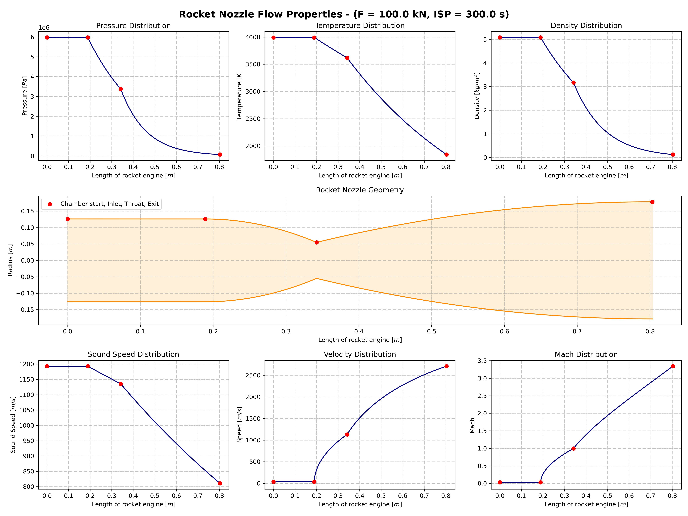
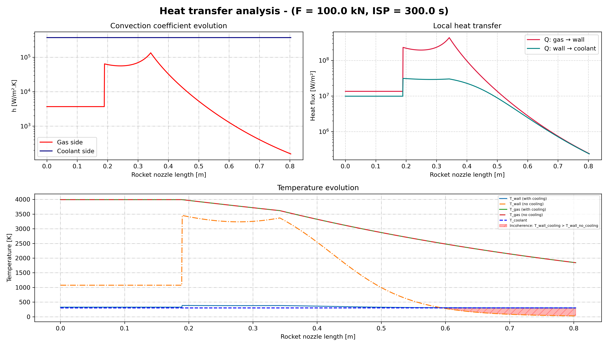

# 🚀 AeroSpaceChallenge: Rocket Combustion Chamber, Nozzle, Thrust Vector Control, and Cooling Simulation

---

## 📚 Description

This Python project simulates:
- the **physical properties** of a **combustion chamber** and **rocket nozzle** for a **nitrous oxide - ethanol** mixture,
- the **dynamic thrust vector control (TVC)** using **PID controllers** for **pitch** and **yaw**,
- the **thermal behavior and cooling efficiency** of the engine using **helical and longitudinal cooling channels**.


It processes experimental data, solves compressible flow equations, applies thrust vectoring, simulates engine cooling, and generates simulation results with visualizations and animations.


---

## 📁 Project Structure

```

AeroSpaceChallenge/ 
│
├── docs/ 
│ ├── data/ 
│ │    └── Protoxyde d'azote - Éthanol.xlsx 
│ ├── data_HeatTransfer/ 
│ │    └── (cooling results: wall/gas temperatures, heatmaps, CSVs) 
│ └── data_TVC/ 
│      └── (generated images and GIF animations)
│
├── src/ 
│ ├── CombustionChamber_Nozzle.ipynb 
│ ├── CoolingSystem.ipynb 
│ └── ThrustVectorControl.ipynb 
├── README.md

```

---

## ⚙️ Main Features

### 🧪 Combustion Chamber and Nozzle Simulation
- 📥 Automatic loading and cleaning of experimental data (`.xlsx` ➔ `.csv`).
- 🧮 Calculation of the average molar mass and specific gas constant for reaction products.
- 🛠️ Solving compressible flow equations in the combustion chamber and nozzle (isentropic assumptions).
- 📊 Export of simulation results as `.csv` files with local physical properties and geometrical dimensions.

### 🎛️ Thrust Vector Control (TVC) Simulation
- 🎯 Independent **PID controllers** for pitch and yaw angles.
- 🧮 RK4 integration for dynamic simulation.
- 📈 Logging of angles, rates, torques, and energies over time.
- 🎥 3D animation of the **thrust vector evolution**.

### 🌡️ Cooling System Simulation
- 🌀 Simulation of **helical** and **longitudinal** cooling channels along the engine.
- 🔥 Calculation of **wall and gas temperatures** with and without active cooling.
- 🧪 Thermodynamic properties computed using **CoolProp** and **Pyromat**.
- 📊 Comparison of wall temperature profiles and evaluation of cooling efficiency.

---

## 🔥 Detailed Processes

### 1. Combustion Chamber and Nozzle

- Reads and cleans the experimental data.
- Calculates thermodynamic constants (\( M_\text{reaction} \) and \( R_\text{reaction} \)).
- Solves the system of equations for:
  - Mass conservation
  - Mach number-area relationship
- Generates `.csv` files containing:
  - Pressures
  - Temperatures
  - Densities
  - Velocities
  - Chamber, throat, and nozzle dimensions
  - Rotational kinetic energies

### 2. Thrust Vector Control (TVC)

- Applies PID control laws on the pitch and yaw dynamics.
- Integrates rotational motion using **RK4** method.
- Limits maximum deflection angles to ±7.5°.
- Computes thrust vector direction and rotational kinetic energy.
- Generates plots for:
  - Pitch and yaw control responses
  - Rotational energy evolution
  - Thrust components
- Produces a **3D animated GIF** showing real-time thrust vector orientation changes.

### 3. Cooling System Simulation

- Modeling of **helical cooling channels** (combustion chamber section) and **longitudinal channels** (nozzle section).
- Calculation of the evolution of **wall** and **gas temperatures** along the engine, with and without cooling.
- Use of **CoolProp** and **Pyromat** to estimate:
  - Specific heat at constant pressure \( C_p \)
  - Specific heat at constant volume \( C_v \)
  - Adiabatic coefficient \( $\gamma$ \)
- Assumptions:
  - 1D heat exchange
  - Defined heat flux between the gas and the wall
  - Unidirectional internal flow
- Results:
  - Temperature mapping
  - Comparison of wall temperatures with and without cooling
  - Evaluation of the cooling system’s effectiveness


---

## 📦 Python Libraries Used

- [numpy](https://numpy.org/)
- [pandas](https://pandas.pydata.org/)
- [scipy.optimize](https://docs.scipy.org/doc/scipy/reference/generated/scipy.optimize.least_squares.html)
- [matplotlib](https://matplotlib.org/)
- [matplotlib.animation (FuncAnimation, PillowWriter)](https://matplotlib.org/stable/api/animation_api.html)
- [mpl_toolkits.mplot3d](https://matplotlib.org/stable/tutorials/toolkits/mplot3d.html)
- [os](https://docs.python.org/3/library/os.html)
- [termcolor](https://pypi.org/project/termcolor/)
- [CoolProp](https://coolprop.org/)
- [pyromat](https://pypi.org/project/pyromat/)

---

## 📌 Important Notes

- **`Protoxyde d'azote - Éthanol.xlsx`** must be placed in `docs/data/`.
- Output images and animation are saved in:
  - `docs/data_TVC/` for thrust vector control results,
  - `docs/data_HeatTransfer/` for cooling simulation outputs.
- Assumptions:
  - Perfect combustion
  - Isentropic flows
  - 1D heat exchange for cooling system
  - Idealized actuator dynamics
- Simulation results are sensitive to:
  - Initial conditions
  - PID tuning
  - Cooling channel geometry and heat transfer coefficients
---

## ✨ Authors

- 🧑‍💻 Project developed by Pierre Lambin--Gosset

---

## 🗂️ Example Outputs

### 📈 Plots
- `FlowProperties.png`: Evolution of flow properties over rocket nozzle
- `HeatTransferAnalyse.png`: Wall and gas temperature evolution along the cooled engine
- `pitch_control.png`: Evolution of the pitch control over time
- `yaw_control.png`: Evolution of the yaw control over time
- `thrust_energy.png`: Thrust components and rotational energy over time

### 🎥 Animation
- `ThrustVectorControl.gif`: 3D animation showing thrust vector evolution

---

## 📈 Preview

### Rocket Nozzle Flow Properties


### Heat Transfert Analysis


### Pitch Control Example


### Yaw Control Example


### Rotational Energy Example


### Thrust Vector Animation Example


---

