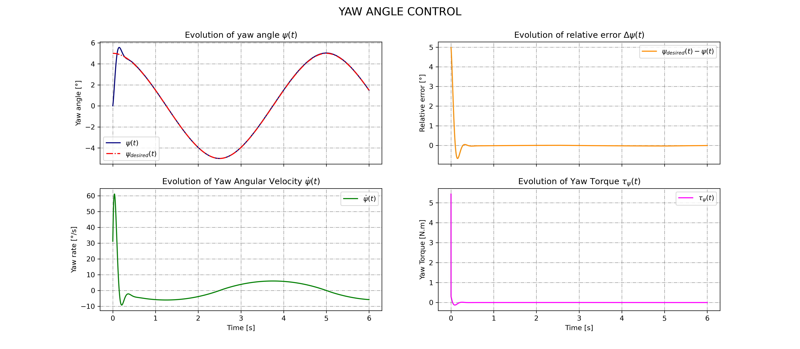

# 🚀 AeroSpaceChallenge: Rocket Combustion Chamber, Nozzle, and Thrust Vector Control Simulation

---

## 📚 Description

This Python project simulates:
- the **physical properties** of a **combustion chamber** and **rocket nozzle** for a **nitrous oxide - ethanol** mixture,
- the **dynamic thrust vector control (TVC)** using **PID controllers** for **pitch** and **yaw**.

It processes experimental data, solves compressible flow equations, applies thrust vectoring, and generates simulation results with visualizations and animations.

---

## 📁 Project Structure

```
AeroSpaceChallenge/
├── docs/
│   ├── data/
│   │   └── Protoxyde d'azote - Éthanol.xlsx
│   └── data_TVC/
│       └── (generated images and GIF animations)
├── src/
│   ├── CombustionChamber_Nozzle.ipynb
│   └── ThrustVectorControl.ipynb
```

---

## ⚙️ Main Features

### 🧪 Combustion Chamber and Nozzle Simulation
- 📥 Automatic loading and cleaning of experimental data (`.xlsx` ➔ `.csv`).
- 🧮 Calculation of the average molar mass and specific gas constant for reaction products.
- 🛠️ Solving compressible flow equations in the combustion chamber and nozzle (isentropic assumptions).
- 📊 Export of simulation results as `.csv` files with local physical properties and geometrical dimensions.

### 🎛️ Thrust Vector Control (TVC) Simulation
- 🎯 Independent **PID controllers** for pitch and yaw angles.
- 🧮 RK4 integration for dynamic simulation.
- 📈 Logging of angles, rates, torques, and energies over time.
- 🎥 3D animation of the **thrust vector evolution**.

---

## 🔥 Detailed Processes

### 1. Combustion Chamber and Nozzle

- Reads and cleans the experimental data.
- Calculates thermodynamic constants (\( M_\text{reaction} \) and \( R_\text{reaction} \)).
- Solves the system of equations for:
  - Mass conservation
  - Mach number-area relationship
- Generates `.csv` files containing:
  - Pressures
  - Temperatures
  - Densities
  - Velocities
  - Chamber, throat, and nozzle dimensions
  - Rotational kinetic energies

### 2. Thrust Vector Control (TVC)

- Applies PID control laws on the pitch and yaw dynamics.
- Integrates rotational motion using **RK4** method.
- Limits maximum deflection angles to ±7.5°.
- Computes thrust vector direction and rotational kinetic energy.
- Generates plots for:
  - Pitch and yaw control responses
  - Rotational energy evolution
  - Thrust components
- Produces a **3D animated GIF** showing real-time thrust vector orientation changes.

---

## 📦 Python Libraries Used

- [numpy](https://numpy.org/)
- [pandas](https://pandas.pydata.org/)
- [scipy.optimize](https://docs.scipy.org/doc/scipy/reference/generated/scipy.optimize.least_squares.html)
- [matplotlib](https://matplotlib.org/)
- [matplotlib.animation (FuncAnimation, PillowWriter)](https://matplotlib.org/stable/api/animation_api.html)
- [mpl_toolkits.mplot3d](https://matplotlib.org/stable/tutorials/toolkits/mplot3d.html)
- [os](https://docs.python.org/3/library/os.html)
- [termcolor](https://pypi.org/project/termcolor/)

---

## 📌 Important Notes

- **`Protoxyde d'azote - Éthanol.xlsx`** must be placed in `docs/data/`.
- Output images and animation are saved in `docs/data_TVC/`.
- Assumptions:
  - Perfect combustion
  - Isentropic flows
  - Idealized actuator dynamics
- Simulation results are sensitive to initial conditions and PID tuning.

---

## ✨ Authors

- 🧑‍💻 Project developed by Pierre Lambin--Gosset

---

## 🗂️ Example Outputs

### 📈 Plots
- `pitch_control.png`: Evolution of the pitch control over time
- `yaw_control.png`: Evolution of the yaw control over time
- `thrust_energy.png`: Thrust components and rotational energy over time

### 🎥 Animation
- `thrust_vector.gif`: 3D animation showing thrust vector evolution

---

## 📈 Preview

### Pitch Control Example


### Yaw Control Example


### Rotational Energy Example


### Thrust Vector Animation Example


---

